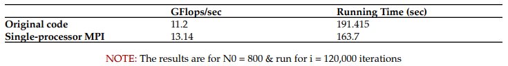
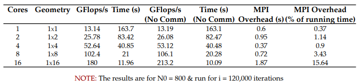
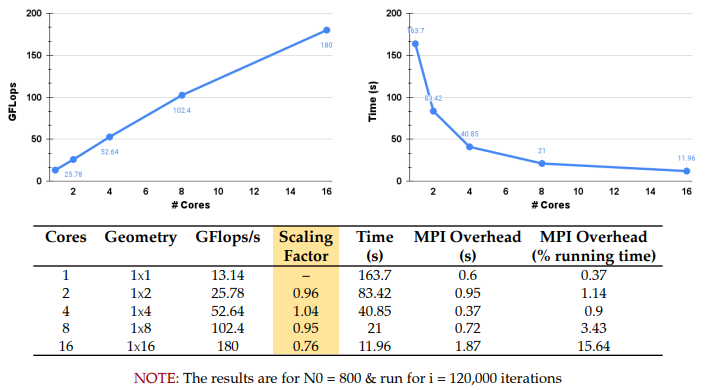
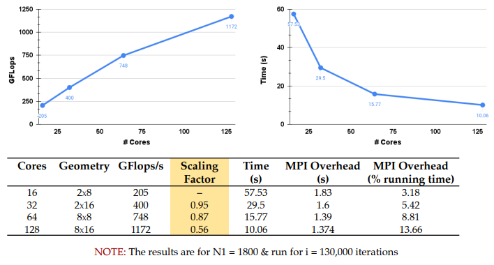
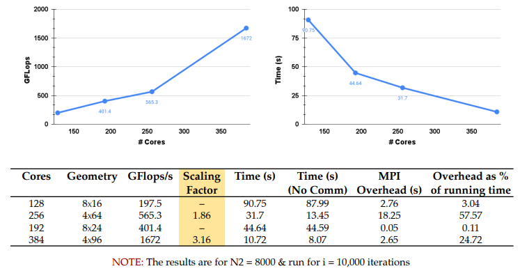
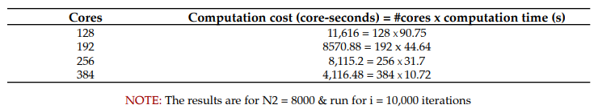
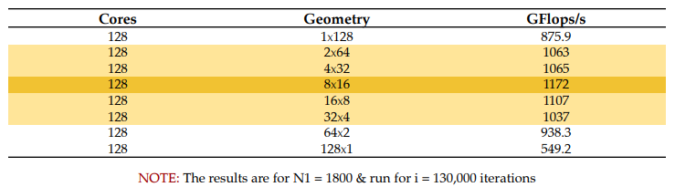
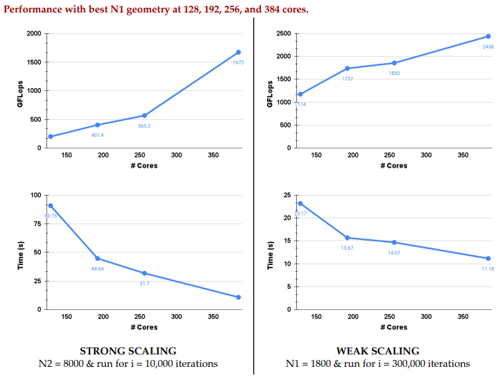
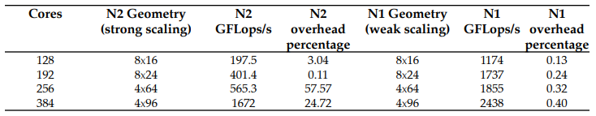

# Using MPI to parallelize Aliev-Panfilov cardiac simulation

Simulations play an important role in science, medicine, and engineering. A cardiac electrophysiology simulator can be used for clinical diagnostic and therapeutic purposes. To reduce computational costs, simplifying assumptions are often made to make the simulations feasible. In clinical examples, time may be of the essence in determining an appropriate life-saving treatment.

Cell simulators entail solving a coupled set of equations: a system of Ordinary Differential Equations (ODEs) together with a Partial Differential Equation (PDE). If you are interested in learning more about cardiac modeling, peruse [www.labheart.org](http://www.google.com/url?q=http%3A%2F%2Fwww.labheart.org%2F&sa=D&sntz=1&usg=AOvVaw0LR5VoK8AgezJBQtIu717V) or [thevirtualheart.org](http://www.google.com/url?q=http%3A%2F%2Fthevirtualheart.org%2F&sa=D&sntz=1&usg=AOvVaw3tnuXIt_l_cX2Ss6fpr0oP) or visit the web page of [Cardiac Mechanics Research Group](http://www.google.com/url?q=http%3A%2F%2Fcmrg.ucsd.edu%2F&sa=D&sntz=1&usg=AOvVaw2KQ92NBopWg_JCy_GVUBcj) and the [Simula Computational Cardiac Modeling Department](https://www.google.com/url?q=https%3A%2F%2Fwww.simula.no%2Fresearch%2Fscientific-computing%2Fcardiac-modeling&sa=D&sntz=1&usg=AOvVaw3UMxGVBMJZ2mPGdP7vP6OS)

The simulator models the propagation of electrical signals in the heart, and it incorporates a cell model describing the kinetics of the membrane of a single cell. There can be different cell models, of varying degrees of complexity. We will use a model known as the Aliev-Panfilov model, which maintains 2 state variables, and solves one PDE (The PDE couples multiple cells into a system). This simple model can account for complex behavior such as how spiral waves break up and form elaborate patterns. Spiral waves can lead to life-threatening situations such as ventricular fibrillation.

The simulator models electrical signals in an idealized biological system in which voltages vary at discrete points in time, called timesteps, at the discrete positions of a mesh. The simulator is an iterative procedure that updates the simulation state variables (on the mesh) many times over a sequence of discrete timesteps. A simulation will run for some amount of simulated time, which is a real number. (For our purposes, the units of time are unimportant.) The timesteps subdivide the simulation timeline that starts at t=0 and ends at some specified time t=T. The unit of subdivision is called Δt, or the time discretization. It is important to keep in mind that when we use the term "time," we need to specify whether we are talking about real-valued simulation time or the discrete timestep. We will use a fully qualified name to avoid ambiguity. By convention, we number the discrete timesteps with integers. Thus, if we say that we are at timestep k of the simulation, then the current simulation time is kΔt.

[Report](Report.pdf) explains all the development in detail and summarizes the performance results of the simulation.

## Results

### MPI implementation vs Original implementation

### Strong Scaling Study

### Performance study from 128 to 384 cores

### Cost of Computation

### Top-performing geometries for p = 128

### Strong and Weak Scaling

## References

1. Microsoft MPI documentation:- MPI Functions - Message Passing Interface | Microsoft Learn
2. Pacheco, “An Introduction to Parallel Programming”  http://www.cs.usfca.edu/~peter/ipp/ipp source.tgz, Morgan Kaufman Publishers
3. “Some ways to think about parallel programming”, http://wgropp.cs.illinois.edu/courses/cs598-s16/lectures/lecture25.pdf
4. M. Banikazemi, R. K. Govihdaraju, R. Blackmore and D. K. Panda, "MPI-LAPI: an efficient implementation of MPI for IBM RS/6000 SP systems," in IEEE Transactions on Parallel and Distributed Systems, vol. 12, no. 10, pp. 1081-1093, Oct. 2001, doi: 10.1109/71.963419.
5. A. Y. Grama, A. Gupta and V. Kumar, "Isoefficiency: measuring the scalability of parallel algorithms and architectures," in IEEE Parallel & Distributed Technology: Systems & Applications, vol. 1, no. 3, pp. 12-21, Aug. 1993, doi: 10.1109/88.242438.
6. Amdahl’s Law:- https://en.wikipedia.org/wiki/Amdahl%27s_law
